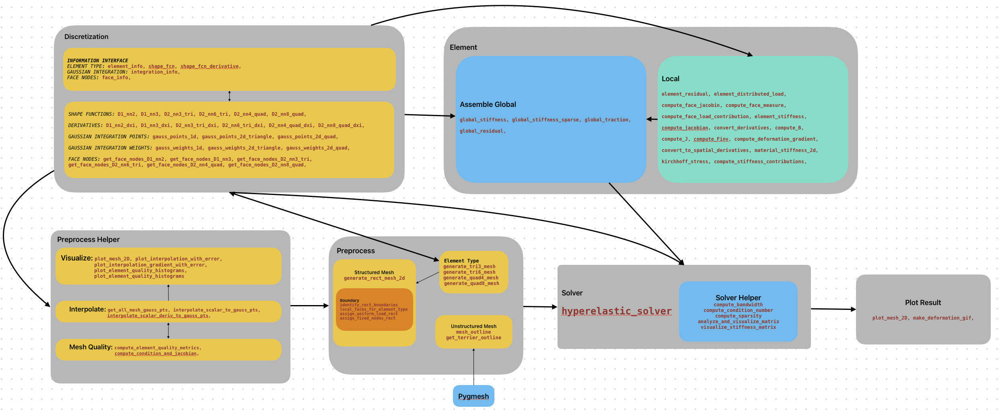

# finite-element-analysis

[](https://www.python.org/)

[](https://github.com/sandialabs/sibl#license)

[](https://codecov.io/gh/Lejeune-Lab-Graduate-Course-Materials/finite-element-analysis)
[](https://github.com/Lejeune-Lab-Graduate-Course-Materials/finite-element-analysis/actions)


### Conda environment, install, and testing

```bash
conda create --name finite-element-analysis-env python=3.12.9
```

```bash
conda activate finite-element-analysis-env
```

```bash
python --version
```

```bash
pip install --upgrade pip setuptools wheel
```

```bash
pip install -e .
```

```bash
pytest -v --cov=finiteelementanalysis --cov-report term-missing
```

# Finite Element Analysis Codebase - Overview


This repository implements a modular 2D Finite Element Analysis (FEA) solver from scratch, with capabilities to solve problems like linear elasticity and hyperelasticity. It is designed for flexibility, educational clarity, and extensibility. A complete example, `full_code_example_1.py`, is provided to demonstrate its usage on a hyperelastic uniaxial extension problem.

---

## 🚀 Code Workflow

### 1. Pre-processing (`pre_process.py`)
- **functionality**: Generates mesh and sets up boundary conditions.
  - `generate_rect_mesh(...)`: Create structured 2D rectangular meshes.
  - `get_dirichlet_nodes(...)`: Determine nodes on domain boundaries.

### 2. Discretization (`discretization.py`)
- **functionality**: Defines basis functions, numerical integration schemes.
- **Core Components**:
  - Basis function evaluations.
  - Gauss quadrature rules.

### 3. Local Element Calculations (`local_element.py`)
- **functionality**: Computes local element stiffness and force vectors.
  - Uses shape function gradients.
  - Handles nonlinear strain energy density functions (for hyperelasticity).

### 4. Global Assembly (`assemble_global.py`)
- **functionality**: Assembles global sparse matrices from local contributions.
  - Efficient sparse matrix handling.
  - Element-to-global DOF mapping.

### 5. Solver (`solver.py`)
  - Newton-Raphson nonlinear solver for hyperelasticity.
  - Applies Dirichlet and Neumann boundary conditions.

### 6. Visualization (`visualize.py`)
  - Plot deformed meshes.
  - Visualize displacement and stress fields.

---

## 📖 Tutorial Example: 
  - `full_code_example_1.py` linear elastic beam
  - `full_code_example_1.py1` hyperelastic large deformation problem
  - `pure_shear.py` a puer sharing testing


---

## 📈 Flow Chart




